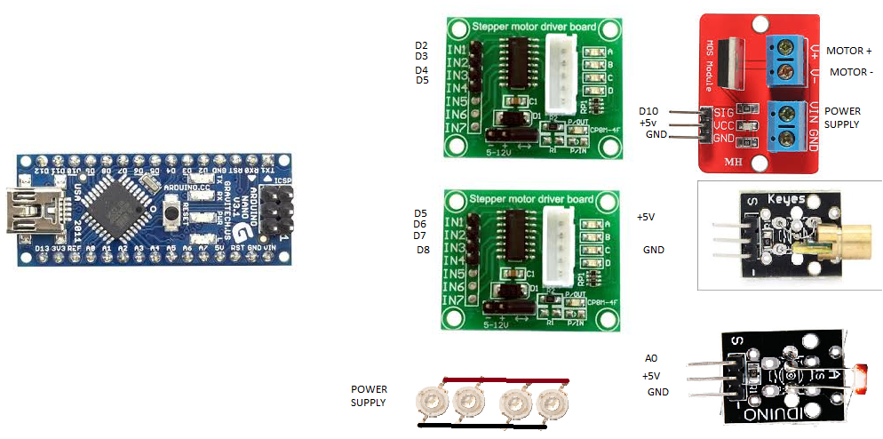
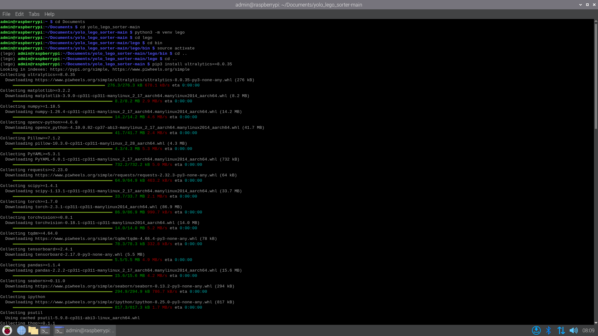
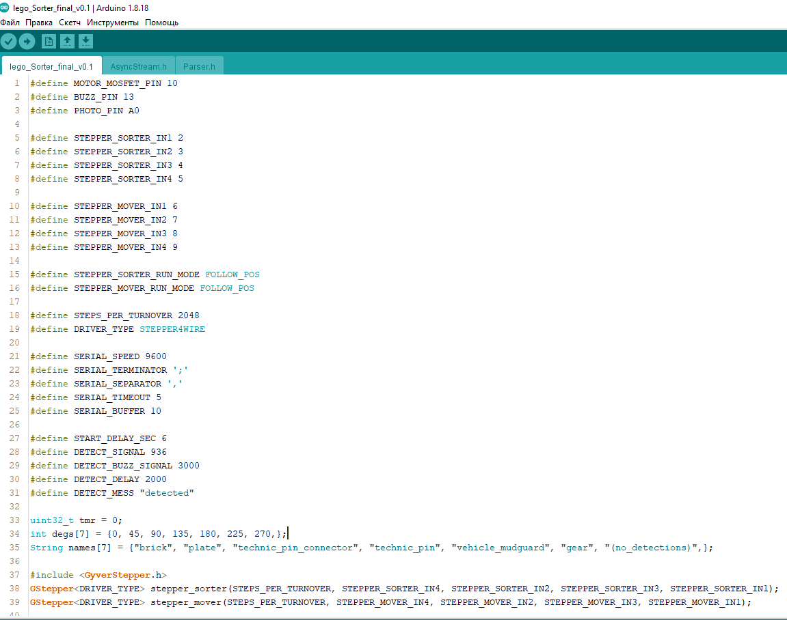
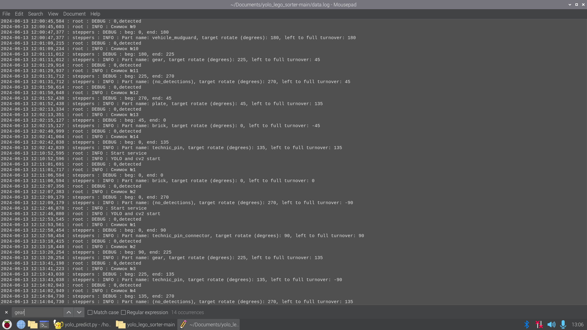

# yolo_lego_sorter

# Описание проекта
Железо:
  1. Сортировщик собран на базе микроконтроллера Arduino Nano
  2. В качестве устройства для распознавания используется Raspberry pi 4B
  3. Два шаговых мотора 20byj-48 с драйверами, один щёточный мотор с мосфетом
  4. Несколько разных конденсаторов
  5. Веб-камера для съёмки деталей с разрешением не мение 480p
  6. Любой источник питания, например лабораторный блок питания W.E.P 1502DD+ или W.E.P PSN-305D (такой мощный необязательно)

В этом проекте используется фреймворк yolo v8

Для того чтобы запустить процесс сортировки деталей нужно:
  1. Установить Python 3.10.x.
  2. Установить Arduino IDE.
  3. Установить среду разработки (Любую IDE, подходящую для Python), но этот шаг можно не делать.
  4. Перейти в IDE для Python и активировать виртуальное акружение.
  5. Установить все неюбходимые библиотеки, при помощи команды pip3 install -r requirements
  6. Перенести файл Lego_Sorter_v0.1.ino в папку для Arduino скетчей, также файлы .h нужно перенести в одну папку с файлом .ino.
  7. Установить все необходимые библиотеки для скетча через "Менеджер библиотек"
  8. Запустить файл .ino, посмотреть или отредактировать все константы #define под себя (если это необходимо), выбрать платы Arduino Nano с Old Bootloader, загрузить скетч.
  9. Спаять/Собрать схему для сортировщика.
  10. Убедившись что предыдущие шаги были выполнены, запустить файл yolo_predict.py (перед этим надо подключить Web-камеру с разрешением не мение чем 480p)
Также если вы начинающий есть статья о том как правильно всё установить https://alexgyver.ru/arduino-first

Разбор файлов .conf:
   1. serial.conf:
      1. port - COM порт, по которому Arduino будет общаться с компьютером.
      2. port_baudrate - Скорость общения Arduino с компьютером в бодах (В этом проекте достаточно будет 9600).
      3. rotate_motor_key - ключ, по которому Python будет отправлять количество градусов для поворота барабана.
      4. move_motor_key - ключ, по которому Python будет отправлять количество градусов для поворота "сдвигателя".
      5. conveyor_motor_key - ключ, по которому Python будет отправлять состояние вращения для ковеера.
      6. lcd_key - ключ, по которому Python будет отправлять название детали, распознанной нейросетью.
      7. conveyor_motor_speed - скорость ковеера.
      8. buzz_signal_delay - время, в течение которого пьезоизлучатель будет издавать писк (в миллисекундах).
   3. img_action.conf:
      1. scale_percent - процент сжатия изображения пр фотографировании (для облегчения распознаваниях).
      2. thresh - порог, при котором цвета станут белыми.
      3. bright - яркость белого цвета.
      4. a и b менять не нужно.
   4. degrees.conf:
      1. brick = 0                    
      2. plate = 45                  
      3. technic_pin_connector = 90   
      4. technic_pin = 135            
      5. vehicle_mudguard = 180       
      6. gear = 225                   
      7. (no_detections) = 270  
      8. step - шаг (разница между двумя любыми последовательными деталями в списке).
      9. seconds_per_step - за сколько секунд прокручивается один шаг.
      10. seconds_per_move - за сколько секунд сдвигается деталька с предметного столика.

Краткий разбор файлов .py:
  1. image_actions.py:
     Подключаются библиотеки cv2 и ConfigParser.
     Дальше идут три функции:
       1. resize_img(input_img) - функция для сжатия изображения по scale_percent. Аргумент input_img - изображения для махинаций.
       2. img_to_gray(inoput_img) - функция для перевода цветного изображения в серо-чёрно-белое.
       3. img_to_binary(input_img) - функция для перевода из серо-чёрно-белого изображения в только чёрно-белое (это помогло мне уменьшить количество фотогорафий в датасете, а также скорость распознавания деталей)
  2. serial_control.py:
     Подключаются три библиотеки: serial, ConfigParser, getLogger.
     Дальше идут важные функции и обьекты:
       1. serial_connection - создание COM подключению к Arduino.
       2. ClosePort() - функция, закрывающая COM подключение.
       3. serialSend(data) - функция, отправляющая сообщение data[1] по ключу data[0]. Параметр data имеет тип list
       4. onRead() - функция, которая читает данные с COM порта - занимается парсингом по ключам.
  3. steppers.py:
     Подключаются четыре библиотеки: configparser, 
     Дальше идут Два класса:
       1. Rotate_Stepper(object) - класс для вращающего шагового двигателя. Под object Rotate_Stepper принимает Сдвигающий шаговый двигатель. Такде есть несколько важных функций:
          1. delta_deg(beg, end) - расчитывает кротчайший путь от текущей позиции вращающего шагового двигателя до заданной.
          2. rotate(data) - поворачивает шаговый двигатель
       2. Move_Stepper - класс для сдвигающего шагового двигателя. Используется в классе Rotate_Stepper.
  4. Подключаются библиотеки: os, threading, logging, cv2, ultalytics
     1. Есть одна очень важная функция main_loop - функция обработки изображения с камеры и распознавания.
     2. В блоке if __name__ == "__main__": запускаются два потока - считывания и распонавания изображений и считыванием данных из COM порта.

# data.log
В файле data.log сохраняются обслалютно все записи из консоли. По большей части это нужно для Дебага программы, если что-то пошло не по плану.
Также data.log можно использовать, как файл в котором сохраняется вся статистика. При повторном запуске yolo_predict.py файл data.log будет не
перезаписан, а дополнен (учитывайте всё выше сказанное). Если файл не нужен удалите строчки с инициализацией и замените все строчки 
"logger.info()" и "logger.debug" на print()

Файл data.log выглядет вот так (Скриншот с Raspberry pi):

Библиотеки в проекте:
  1. GyverStepper.h - https://alexgyver.ru/gyverstepper/
  2. GyverOLED.h - https://alexgyver.ru/lessons/gyverlibs/
  3. Parser.h - (библиотека должна быть с файлом .ino) https://github.com/AlexGyver/tutorials/blob/master/processingSerial/blank/serialArduBlank/Parser.h
  4. AsyncStream.h - (библиотека должна быть с файлом .ino) https://github.com/GyverLibs/AsyncStream

Дополнительная информация:
  1. Мой YouTube канал - https://www.youtube.com/channel/UC8cQtZ49KFYy3E-_9oM-eKg
  2. Мой Rutube канал - https://rutube.ru/channel/32348332/
  3. Можешь стать моим бустером - https://boosty.to/attermiter
  4. Источник уроков - https://alexgyver.ru
